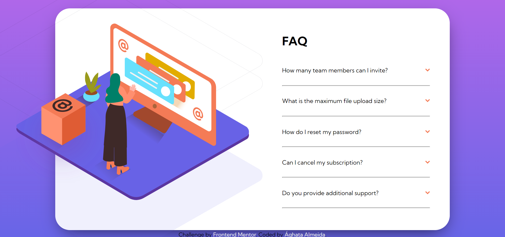
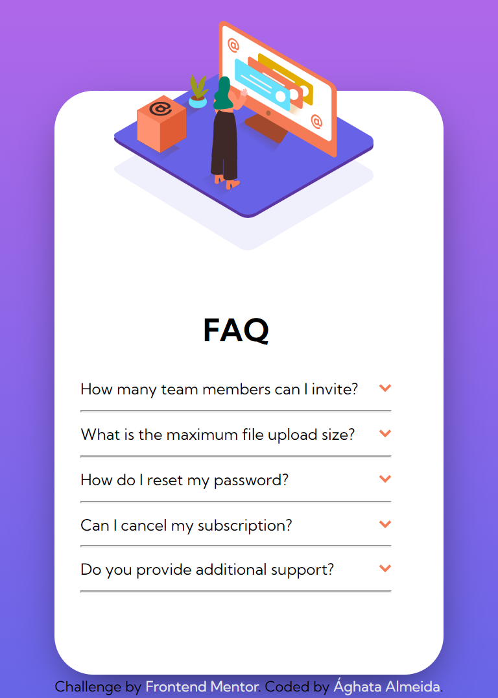

# Frontend Mentor - FAQ accordion Card solution

Essa é uma solução para o desafio ["FAQ accordion card challenge on Frontend Mentor"](https://www.frontendmentor.io/challenges/faq-accordion-card-XlyjD0Oam).

## Índice

- [Visão geral](#visão-geral)
- [O desafio](#desafio)
- [Screenshots](#screenshots)
- [Links](#links)
- [Ferramentas](#ferramentas)

## Visão Geral

O objetivo desse desafio era criar um card de FAQ usando HTML, CSS e JavaScript.

### Desafio

Os usuários devem ser capazes de:

- Ver o layout adaptado de acordo com o tamanho da tela de seu dispositivo.
- Mostrar/Esconder a resposta para uma pergunta ao clicar na pergunta.

### Screenshots
Versão Desktop: 

Versão Mobile:

### Links

- Solução: [Veja no FrontEnd Mentor](https://www.frontendmentor.io/solutions/faq-accordion-card-html-scss-javascript-qTDj2MdSA7)
- Live Site URL: [Clique aqui.](https://faq-accordion-card-psi-ecru.vercel.app/)

### Ferramentas

- HTML5
- CSS
- Flexbox
- CSS Grid
- JavaScript
- SASS/SCSS
